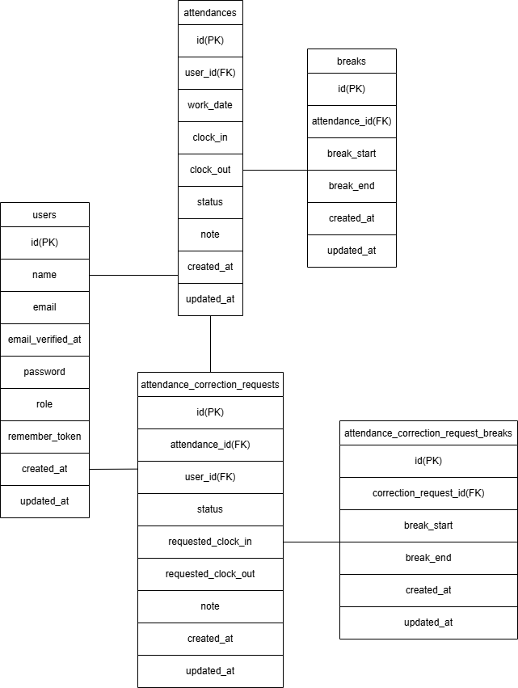

# 勤怠管理アプリ

## 環境構築

### Dockerビルド

1. リポジトリをクローン

```bash
git clone git@github.com:nagaki813/coachtech-attendance-management.git
```

2. DockerDesktopアプリを立ち上げる

3. docker-compose up -d --build

```bash
docker-compose up -d --build
```

```yaml
mysql:
    image: mysql:8.0.26
    platform: linux/x86_64
```

### Laravel環境構築

1. PHPコンテナへ入る

```bash
docker-compose exec php bash
```

2. Composerパッケージのインストール

```bash
composer install
```

3. .env.example ファイルから .env を作成し、環境変数を変更

```bash
cp .env.example .env
```

```env
DB_CONNECTION=mysql
DB_HOST=mysql
DB_PORT=3306
DB_DATABASE=attendance_db
DB_USERNAME=attendance_user
DB_PASSWORD=attendance_pass

MAIL_MAILER=smtp
MAIL_HOST=mailhog
MAIL_PORT=1025
MAIL_USERNAME=null
MAIL_PASSWORD=null
MAIL_ENCRYPTION=null
MAIL_FROM_ADDRESS="test@example.com"
MAIL_FROM_NAME="Attendance App"
```

4. アプリケーションキーの作成

```bash
php artisan key:generate
```

5. マイグレーションの実行

```bash
php artisan migrate
```

6. シーディングの実行

```bash
php artisan db:seed
```

## 使用技術（実行環境）

* PHP 8.1.34
* Laravel 10.50.2
* MySQL 8.0.26
* nginx 1.21.1
* Docker / Docker Compose
* Mailhog

## ER図




## URL

* 開発環境：[http://localhost/](http://localhost/)
* phpMyAdmin：[http://localhost:8080/](http://localhost:8080/)
* Mailhog：[http://localhost:8025/](http://localhost:8025/)

---

# 機能一覧

## 一般ユーザー

* 会員登録
* ログイン
* ログアウト
* メール認証
* 出勤
* 休憩開始
* 休憩終了
* 退勤
* 勤怠一覧表示
* 勤怠詳細表示
* 勤怠修正申請
* 修正申請一覧表示

## 管理者

* 管理者ログイン
* 日次勤怠一覧表示
* 勤怠詳細確認・修正
* スタッフ一覧表示
* スタッフ別月次勤怠一覧表示
* CSV出力
* 修正申請一覧表示
* 修正申請承認
* 修正申請却下

---

# テーブル設計

## usersテーブル

| カラム名              | 型               | 説明             |
| ----------------- | --------------- | -------------- |
| id                | bigint unsigned | 主キー            |
| name              | varchar(255)    | ユーザー名          |
| email             | varchar(255)    | メールアドレス        |
| email_verified_at | timestamp       | メール認証日時        |
| password          | varchar(255)    | パスワード          |
| role              | varchar(255)    | 権限(user/admin) |
| remember_token    | varchar(100)    | ログイン保持用トークン    |
| created_at        | timestamp       | 作成日時           |
| updated_at        | timestamp       | 更新日時           |

## attendancesテーブル

| カラム名       | 型               | 説明            |
| ---------- | --------------- | ------------- |
| id         | bigint unsigned | 主キー           |
| user_id    | bigint unsigned | usersテーブル外部キー |
| work_date  | date            | 勤務日           |
| clock_in   | datetime        | 出勤時間          |
| clock_out  | datetime        | 退勤時間          |
| status     | varchar(255)    | 勤怠状態          |
| note       | text            | 備考            |
| created_at | timestamp       | 作成日時          |
| updated_at | timestamp       | 更新日時          |

## breaksテーブル

| カラム名          | 型               | 説明                  |
| ------------- | --------------- | ------------------- |
| id            | bigint unsigned | 主キー                 |
| attendance_id | bigint unsigned | attendancesテーブル外部キー |
| break_start   | datetime        | 休憩開始                |
| break_end     | datetime        | 休憩終了                |
| created_at    | timestamp       | 作成日時                |
| updated_at    | timestamp       | 更新日時                |

## attendance_correction_requestsテーブル

| カラム名                | 型               | 説明                  |
| ------------------- | --------------- | ------------------- |
| id                  | bigint unsigned | 主キー                 |
| attendance_id       | bigint unsigned | attendancesテーブル外部キー |
| user_id             | bigint unsigned | usersテーブル外部キー       |
| status              | varchar(255)    | 申請状態                |
| requested_clock_in  | datetime        | 修正後出勤時間             |
| requested_clock_out | datetime        | 修正後退勤時間             |
| note                | text            | 修正理由                |
| created_at          | timestamp       | 作成日時                |
| updated_at          | timestamp       | 更新日時                |

## attendance_correction_request_breaksテーブル

| カラム名                  | 型               | 説明                                     |
| --------------------- | --------------- | -------------------------------------- |
| id                    | bigint unsigned | 主キー                                    |
| correction_request_id | bigint unsigned | attendance_correction_requestsテーブル外部キー |
| break_start           | datetime        | 修正後休憩開始                                |
| break_end             | datetime        | 修正後休憩終了                                |
| created_at            | timestamp       | 作成日時                                   |
| updated_at            | timestamp       | 更新日時                                   |

---

# バリデーション

## 会員登録

* 名前：必須、255文字以内
* メールアドレス：必須、メール形式、255文字以内、一意
* パスワード：必須、8文字以上、確認用一致

## ログイン

* メールアドレス：必須、メール形式
* パスワード：必須

## 勤怠修正申請

* 出勤時間：必須、H:i形式
* 退勤時間：必須、H:i形式
* 休憩時間：H:i形式
* 備考：必須、255文字以内
* 出勤時間 < 退勤時間
* 休憩時間は勤務時間内

## 管理者勤怠修正

* 出勤時間：必須、H:i形式
* 退勤時間：必須、H:i形式
* 休憩時間：H:i形式
* 備考：必須、255文字以内
* 出勤時間 < 退勤時間
* 休憩時間は勤務時間内

---

# テスト

```bash
php artisan test
```

実装済みテスト：

* RegisterTest
* LoginTest
* AdminLoginTest
* EmailVerificationTest
* AttendanceIndexTest
* ClockInTest
* BreakTest
* ClockOutTest
* AttendanceListTest
* AttendanceDetailTest
* AttendanceCorrectionRequestTest
* AdminAttendanceListTest
* AdminCorrectionRequestListTest
* AttendanceCorrectionRequestApprovalTest

全46件成功確認済み。
